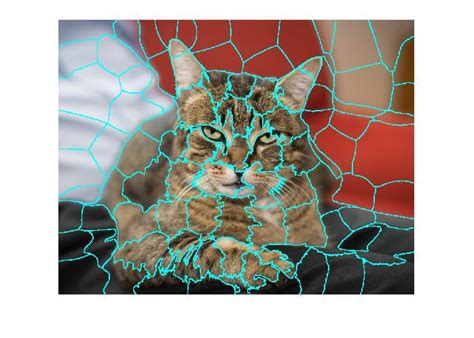
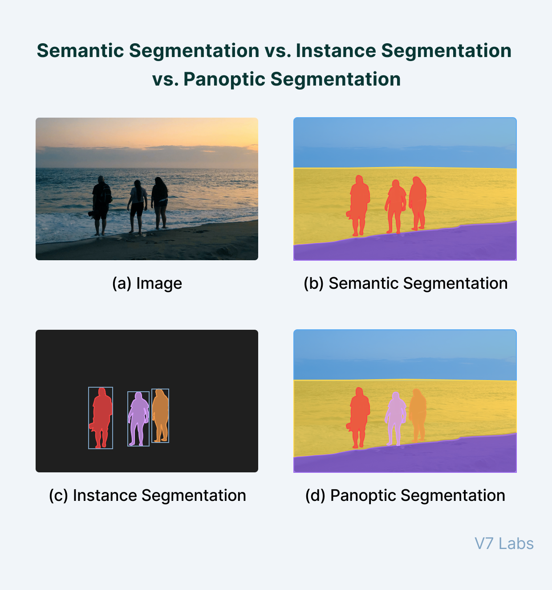

### Introduction

Image segmentation is a crucial technique in computer vision that involves partitioning an image into meaningful segments. This blog will explore the concept of segmentation, explain what superpixels are, and detail the different types of segmentation techniques: semantic segmentation, instance segmentation, and panoptic segmentation.

### What is Segmentation?

Image segmentation is the process of partitioning an image into groups of similar pixels, which helps to simplify or change the representation of an image into something more meaningful and easier to analyze.

### What are Superpixels?

Superpixels are clusters of pixels grouped together based on similarity in color, texture, or other low-level features. They serve as the building blocks for segmentation, providing a more efficient representation of the image.

### Types of Segmentation

- **Semantic Segmentation**
- **Instance Segmentation**
- **Panoptic Segmentation**

### Semantic Segmentation

Semantic segmentation involves assigning a label to every pixel in an image. Each pixel is classified as belonging to a particular class, such as "cat," "dog," "car," etc. This method does not differentiate between different instances of the same class.

### Instance Segmentation

Instance segmentation is similar to object detection but goes a step further by providing a mask that outlines the object, rather than just a bounding box. This technique is used to delineate the boundaries of each object instance in the image, allowing for the identification of multiple objects from the same class.

### Panoptic Segmentation

Panoptic segmentation is a combination of both semantic and instance segmentation. It assigns a class to every pixel, and if there are multiple instances of a class, it distinguishes which pixels belong to which instance. This comprehensive approach ensures that each object is uniquely identified and classified.

### Conclusion

Image segmentation is a powerful tool in computer vision, enabling more accurate image analysis and interpretation. Understanding the different types of segmentation techniques is essential for various applications, from medical imaging to autonomous driving.
