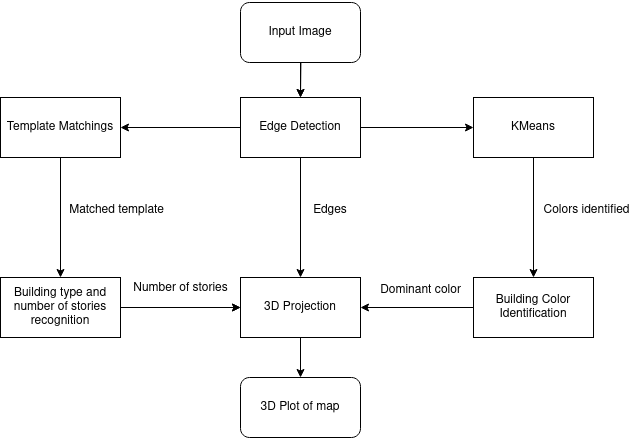
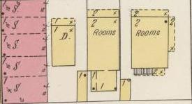
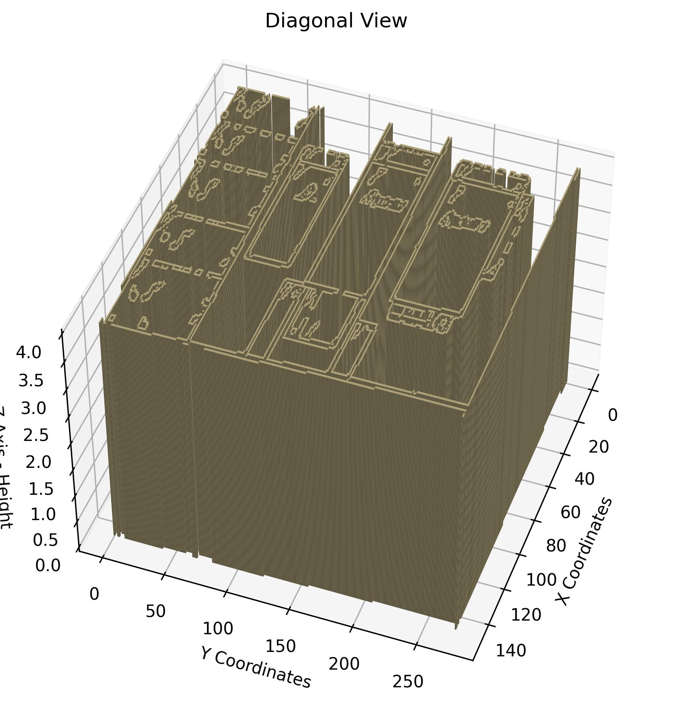

## Introduction
The goal of this project is to develop a robust methodology for transforming 2D Sanborn maps into 3D neighborhood models. The process involves:

- Identifying building footprints
- Classifying building types
- Estimating the number of stories
- Providing a visual representation of the recognized structures

## Methodology

<i>Implementation Pipeline</i>

### Step 1: Edge Detection
We begin with an input image of a Sanborn map. Edge detection is performed to identify the building footprints.

### Step 2: Template Matching
The detected edges are sent to a template matching function to identify the type of building and estimate the number of stories.

### Step 3: Color Identification
Simultaneously, the detected edges are processed using the KMeans algorithm to identify the color of the buildings. This involves processing the pixels within the region demarcated by the detected edges.

### Step 4: 3D Projection
Finally, the processed data is projected to create the final 3D plot, giving a visual representation of the neighborhood.

<i>Sanborn Map</i>

## Results
The end result is a 3D representation of the neighborhood, showcasing the identified structures with their respective attributes.

<i>3D Representation</i>

## Conclusion
This methodology provides an efficient way to convert 2D Sanborn maps into 3D models, facilitating better visualization and analysis of neighborhood structures.
